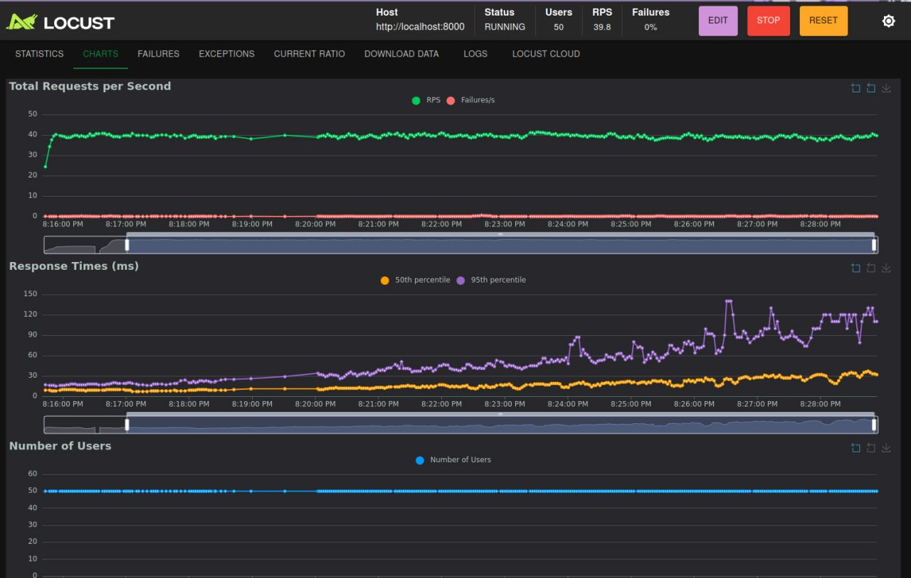
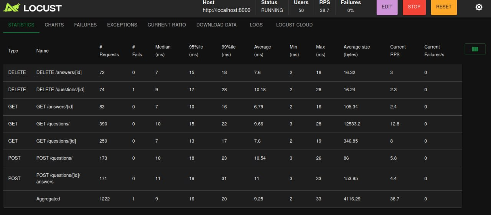

# Анализ результатов нагрузочного тестирования (Proof of Concept)

## 📊 Обзор теста

Тестирование проводилось с помощью **Locust** для оценки базовой производительности API. Основные метрики, наблюдаемые в ходе теста:

- **Пиковая нагрузка:** ~50 виртуальных пользователей
- **RPS:** ~40 запросов в секунду
- **Время отклика (95-й процентиль):** ~120-150 мс
- **Количество ошибок:** Минимальное (близко к нулю)

## ⚠️ Важные ограничения методологии

**Важно понимать:** Данные результаты являются **демонстрацией работоспособности (proof of concept)** и не отражают реальную производительность системы в продакшен-среде.

### 1. Локальная петля (Loopback)
- И API (`localhost:8000`), и нагрузочный тестер (Locust) работали на **одной и той же машине**
- Запросы обрабатывались через внутренний интерфейс loopback (`127.0.0.1`)
- **Следствия:**
  - Исключаются сетевые задержки (latency)
  - Значительно завышаются показатели RPS
  - Снижается время отклика
  - Не моделируется реальный сетевой сценарий

### 2. Конкуренция за ресурсы
На одной машине concurrently работали:
- **Испытательный стенд (Locust)** - генератор нагрузки
- **Испытуемая система (API)** - обработка запросов
- **База данных** (если локальная) - хранение данных
- **Фоновые процессы ОС** и другое ПО

**Результат:** Конкуренция за CPU, RAM и I/O могла стать "бутылочным горлышком" и исказить результаты.

### 3. Несерверное железо
Тест запускался на **рабочем ноутбуке**, что introduces:
- **Термальное троттлинг** - снижение частоты CPU при перегреве
- **Энергосбережение** - ограничения производительности от настроек питания ОС
- **Фоновая активность** - влияние других приложений
# Результаты из locust

## Что можно понять из этих результатов

Несмотря на ограничения, тест подтверждает базовую жизнеспособность приложения:

### ✅ Положительные признаки
- **Система работоспособна под нагрузкой:** При ~50 пользователях нет катастрофического роста времени отклика
- **Отсутствие ошибок:** Количество failures/s близко к нулю
- **Стабильность:** Графики RPS и времени отклика без резких пиков и провалов
- **Приемлемая производительность для PoC:** 95-й процентиль ~120-150 мс

### 🔮 Потенциальные возможности
- **Пропускная способность:** ~40 RPS на локальной машине suggests возможность на порядок большего показателя на продакшен-сервере
- **Масштабируемость:** Стабильность графиков under load indicates хороший потенциал для масштабирования

## 🎯 Выводы и рекомендации

### Proof of Concept УСПЕШЕН:
1. ✅ Архитектура приложения выдерживает базовую нагрузку
2. ✅ Отсутствуют грубые ошибки, приводящие к падению под давлением
3. ✅ Задел производительности выглядит положительным

### Как можно улучшить исследование производительности:
1. **Тестирование в приближенных к боевым условиям:**
   - Развернуть API и БД на выделенных серверах/контейнерах
   - Запускать нагрузку с отдельной машины
   - Использовать сетевое разделение

2. **Углубленное тестирование:**
   - Нагрузочное тестирование с постепенным увеличением пользователей
   - Стресс-тестирование на предельных нагрузках
   - Выявление точек деградации производительности

3. **Мониторинг ресурсов:**
   - Контроль использования CPU, RAM, I/O
   - Анализ работы базы данных под нагрузкой
   - Поиск узких мест в системе

**Заключение:** Результаты обнадеживают и показывают, что система готова к более серьезному тестированию в реалистичных условиях.