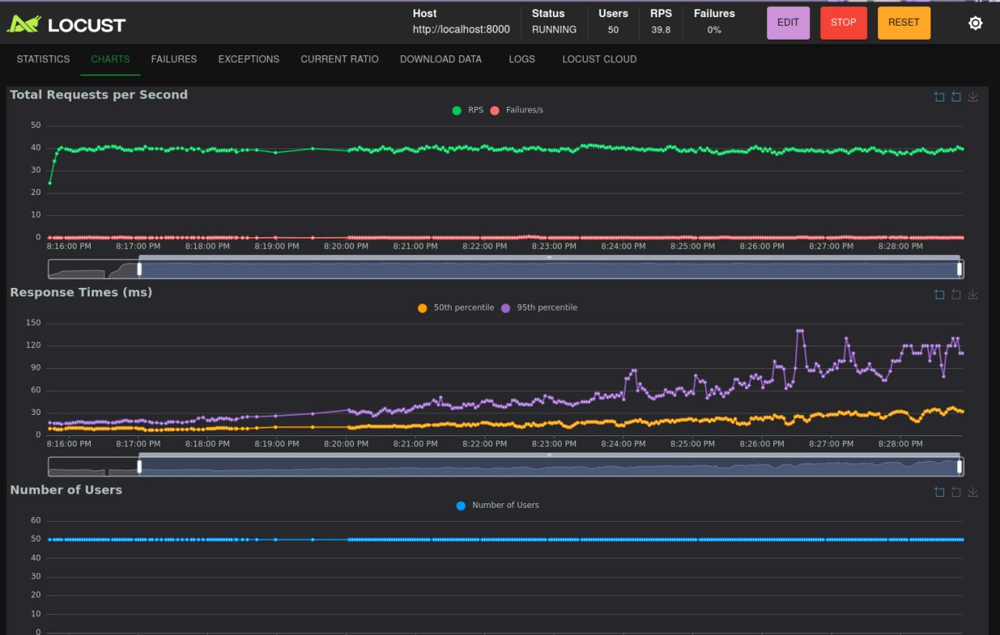
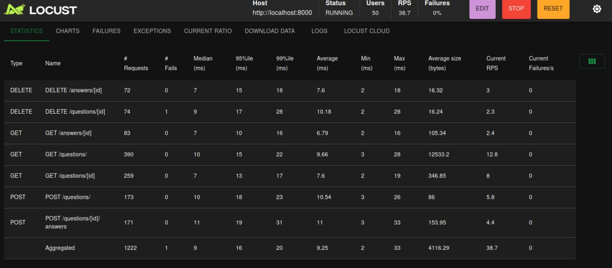

# Load Testing Results Analysis (Proof of Concept)

## 📊 Test Overview

Testing was conducted using **Locust** to evaluate the basic performance of the API. Key metrics observed during the test:

- **Peak Load:** ~50 virtual users
- **RPS:** ~40 requests per second
- **Response Time (95th percentile):** ~120-150 ms
- **Error Rate:** Minimal (close to zero)

## ⚠️ Important Methodology Limitations

**Important to understand:** These results represent a **proof of concept demonstration** and do not reflect real-world system performance in a production environment.

### 1. Local Loopback
- Both the API (`localhost:8000`) and the load tester (Locust) ran on **the same machine**
- Requests were processed through the internal loopback interface (`127.0.0.1`)
- **Consequences:**
  - Network latency is eliminated
  - RPS metrics are significantly inflated
  - Response times are artificially reduced
  - Does not model real-world network scenarios

### 2. Resource Competition
The following components ran concurrently on the same machine:
- **Test bench (Locust)** - load generator
- **System under test (API)** - request processing
- **Database** (if local) - data storage
- **OS background processes** and other software

**Result:** Competition for CPU, RAM, and I/O resources could create bottlenecks and distort results.

### 3. Non-Server Hardware
The test was run on a **work laptop**, which introduces:
- **Thermal throttling** - CPU frequency reduction due to overheating
- **Power management** - performance limitations from OS power settings
- **Background activity** - interference from other applications
# Locust results

## 📈 What CAN Be Understood from These Results

Despite the limitations, the test confirms basic application viability:

### ✅ Positive Indicators
- **System operational under load:** No catastrophic response time degradation at ~50 users
- **Minimal errors:** Failure rate close to zero
- **Stability:** RPS and response time graphs show no sharp spikes or drops
- **Acceptable PoC performance:** 95th percentile ~120-150 ms is respectable for local testing

### 🔮 Potential Capabilities
- **Throughput capacity:** ~40 RPS on local machine suggests potential for order-of-magnitude higher performance on production servers
- **Scalability potential:** Graph stability under load indicates good scaling potential

## 🎯 Conclusions and Recommendations

### Proof of Concept SUCCESSFUL:
1. ✅ Application architecture handles basic load
2. ✅ No critical errors causing system failure under pressure
3. ✅ Performance foundation appears positive

### How to Improve Performance Investigation:
1. **Testing in production-like conditions:**
   - Deploy API and DB on dedicated servers/containers
   - Run load tests from separate machines
   - Implement network separation

2. **Comprehensive testing:**
   - Load testing with gradual user increase
   - Stress testing at maximum loads
   - Identification of performance degradation points

3. **Resource monitoring:**
   - CPU, RAM, and I/O usage monitoring
   - Database performance analysis under load
   - Bottleneck identification

**Conclusion:** The results are encouraging and demonstrate that the system is ready for more serious testing in realistic conditions.